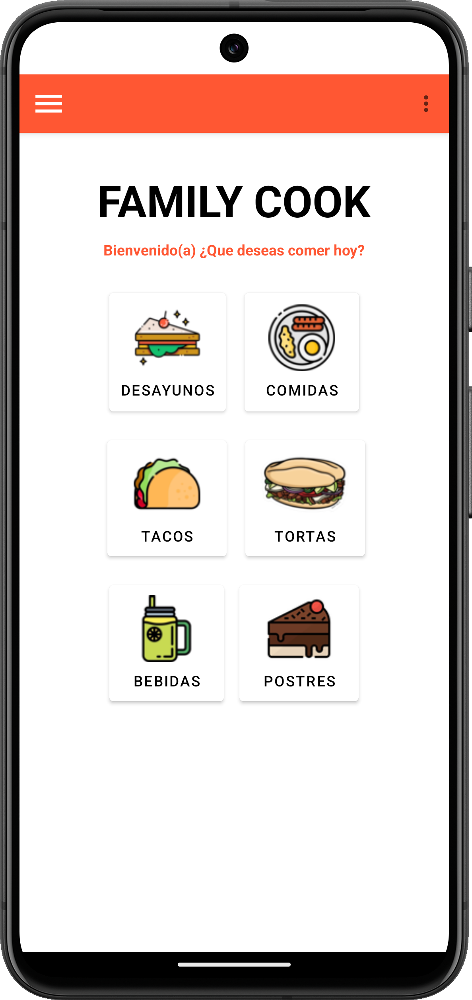
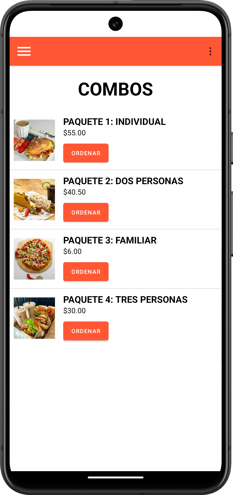
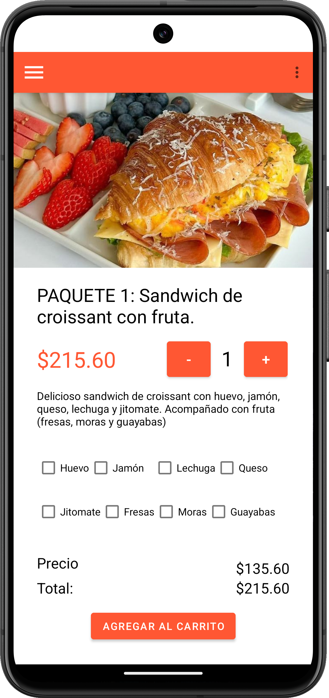
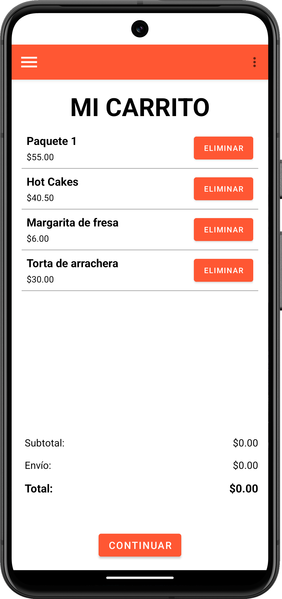
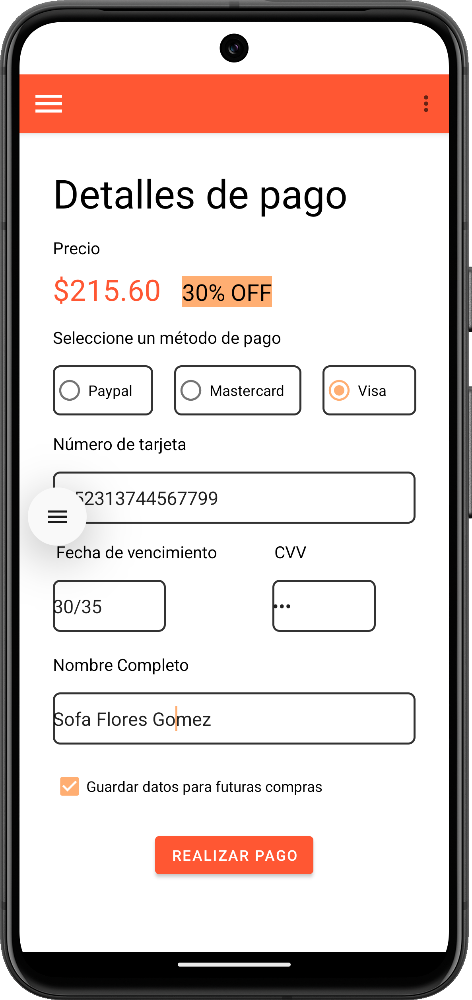
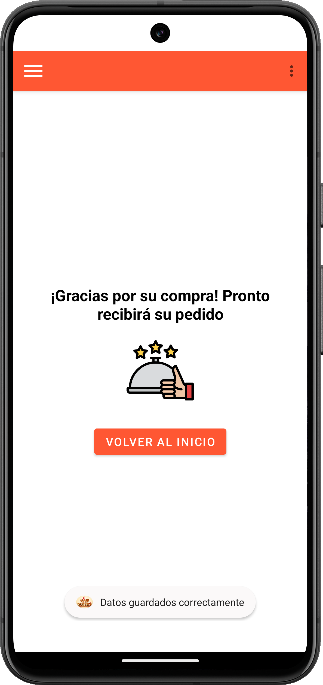
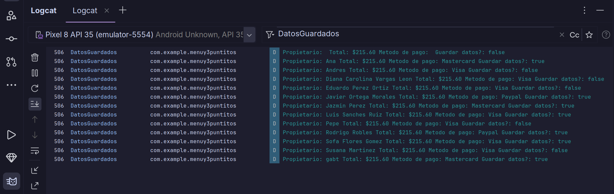

# ✨📌 PROYECTO FINAL 

* **Alumna**: López Diego Gabriela 
* **Número de cuenta:** 318243485
* **Fecha de entrega:** 04 de Diciembre del 2024

`Descripción del proyecto final:` Se agregó a la tarea 4, una base de datos capaz de capturar los datos proporcionados por el usuario en el formulario de la actividad _detalle de pago_. 
En nuestro caso, usamos la base de datos predeterminada por android, SQLite. 

Para observar los cambios realizados, debemos realizar los siguientes pasos:

1. `Abrir` el menú izquierdo desplegable. 
2. Dar click a la opción `COMBOS`.
3. Seleccionar el paquete 1 y dar click en `ordenar`.
4. Se mostrará a detalle en lo que consiste el `paquete 1`, seleccionamos los ingredientes que deseemos agregar y damos click en `agregar a carrito`.
5. Se nos muestra el estado actual de nuestro carrito de compras, si estamos seguros de continuar con nuestra compra, damos click en `continuar`. 
6. Luego, habrá que rellenar el formulario de la vista `Detalle de pago` para capturar los detalles de nuestra tarjeta. Cuando hayamos terminado damos click en `Realizar pago`.
7. Al presionar el botón `Realizar pago` los datos proporcionados se guardarán en nuestra base de datos y tabla correspondiente. También, se nos redirige a otra actividad para indicarle al usuario que ya ha terminado y puede volver al inicio de la aplicación con el botón `volver al inicio`.

 

    
    
    

 

Rellenar los datos que se solitan en la vista **Realizar pago**

    
    
    

 

    
    

 

### ¿Como podemos comprobar que los datos se hayan guardado correctamente en la base de datos SQLite?

Para ello, utilizaremos el método getAll en `DetallePagoActivity.java` para recuperar todos los registros de la tabla datos_de_tarjeta y luego mostrarlos en LogCat. Notemos que aunque cerremos la aplicación o reiniciemos el dispositivo, aún podemos observar los registros que anteriormente se hemos capturado. 
Convirtiendo así nuestros datos persistentes. 

 

    

 