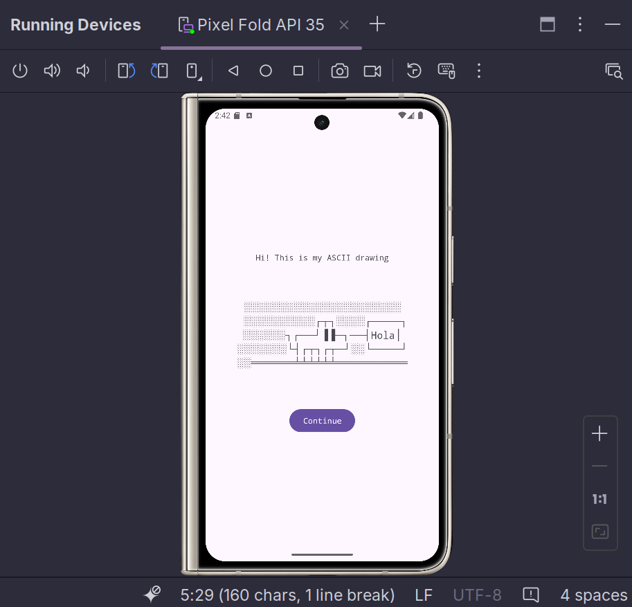

#Tarea 01

Creación de un dibujo de caracteres en código ASCII dentro de una aplicación móvil utilizando el ambiente Android Studio y el emulador. El dibujo realizo fue el siguiente:

░░░░░░░░░░░░░░░░░░░░░░
░░░░░░░░░░┌┬┐░░░░┌────┐
░░░░░░┐┌──┘▐▐──┐──┤Hola│
░░░░░░░└┤┌┬┐┌┬─┘░░└────┘
░░░══════╧╧╧╧╧╧══════════

A continuación se muestra el resultado final:

