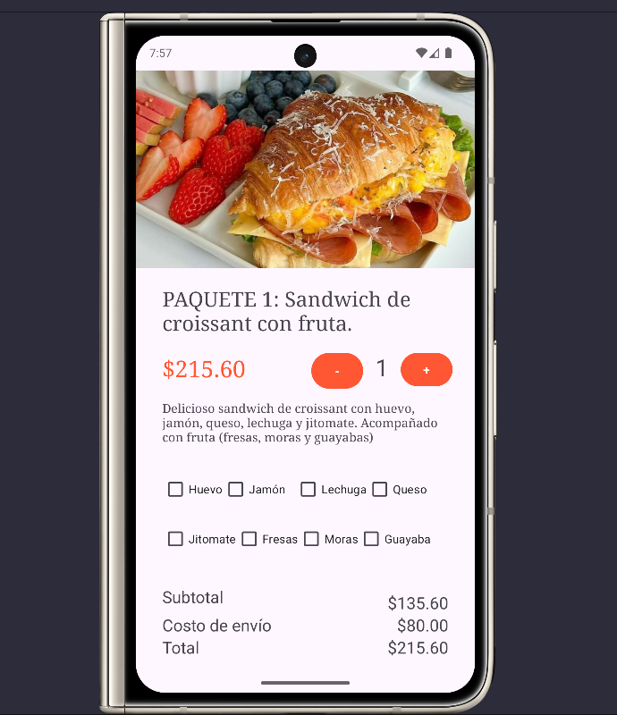
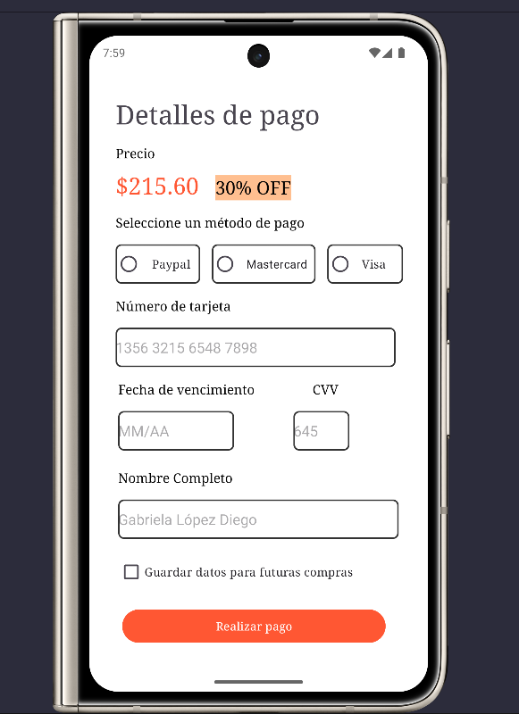
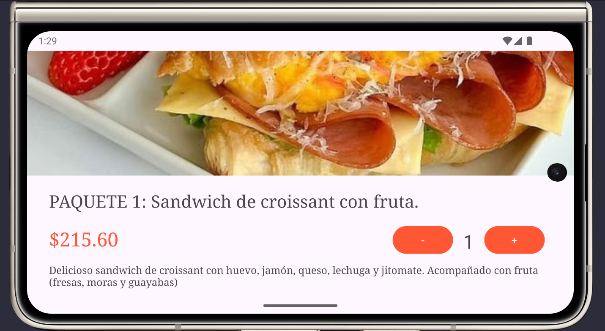
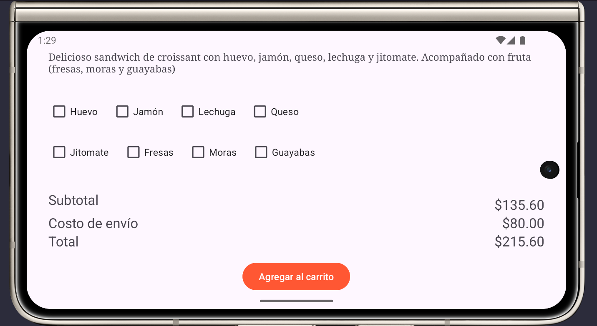
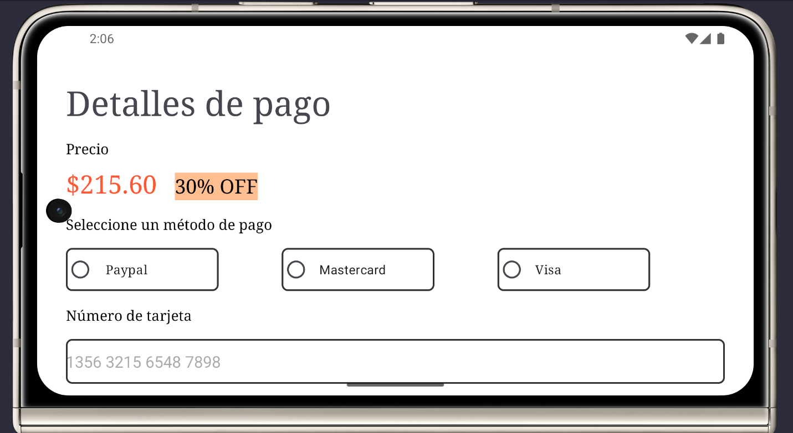
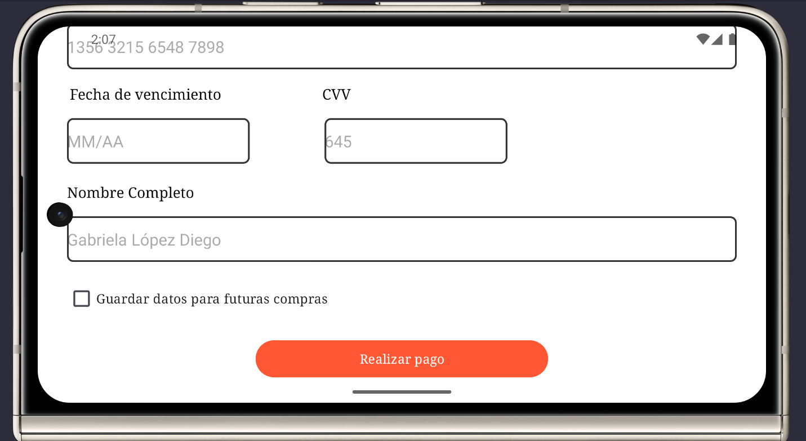
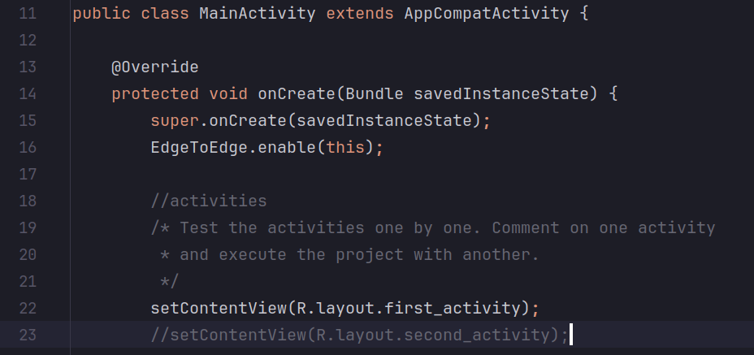

# 🌱 Tarea 02  ☕ 🥪

Creación de dos vistas (actividades) para una aplicación móvil de un restaurante, por el cual se puede realizar pedidos y el pago de alimentos.
 

* Objetivo: Realizar dos actividades donde cada una muestre un formulario usando leyendas, cajas de texto, checkbox, radio botones, botones, imágenes, etc.
* Nota: Las pantallas NO se comunican entre sí (todavía).

Resultado actividad 1 y actividad 2 (ORIENTACIÓN VERTICAL): 

    
    

 
Resultado actividad 1 (ORIENTACIÓN HORIZONTAL): 
 

    
    

 
Resultado actividad 2 (ORIENTACIÓN HORIZONTAL): 
 

    
    

 

 
Para probar cada una de las actividades de la aplicación móvil, hay que ir alternando con comentarios `setContentView(R.layout.first_activity)` y `setContentView(R.layout.second_activity)` que se encuentran dentro de `java/MainActivity.java`.  
 

Resultado actividad 2 explicada:

