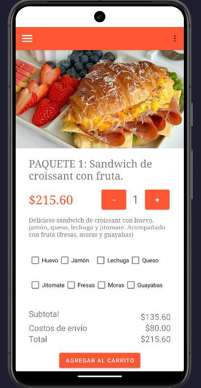
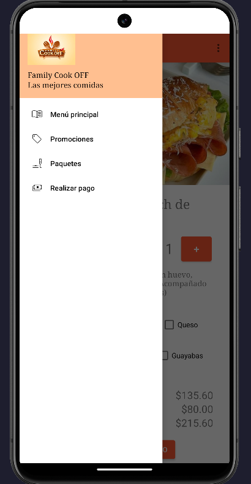
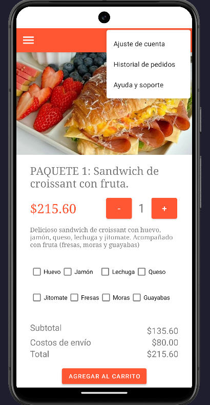
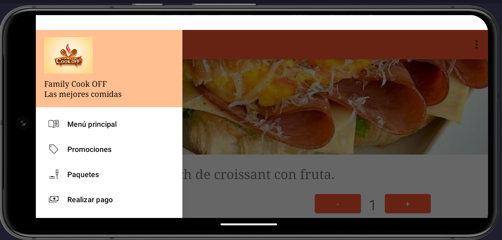
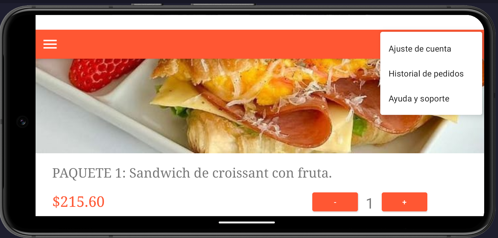
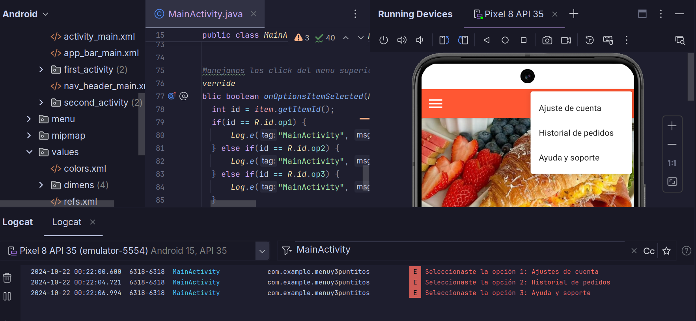
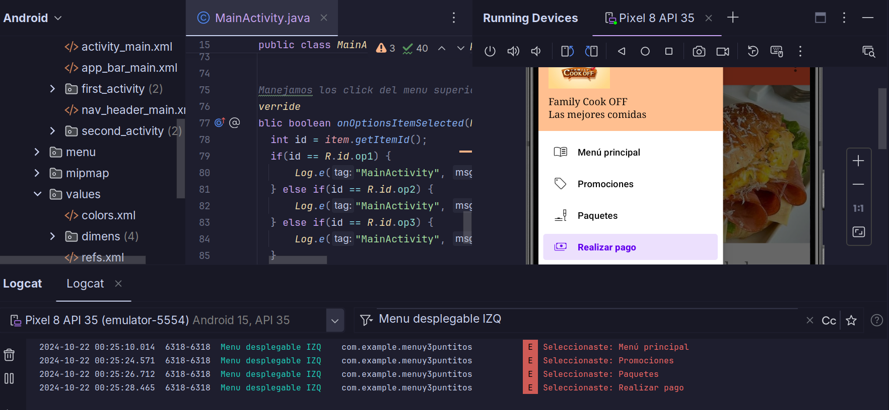

# 📌 Tarea 03: Navigation Drawer & Action Menu  ☕ 🥪

* **Alumna: López Diego Gabriela** 
* **No de cuenta: 318243485**

La tarea 3 consiste en integrar dos componentes a la tarea 2: un menú izquierdo desplegable (Navigation Drawer) y un menú de tres puntitos (Action Menu). Cuando el usuario selecciona una opción de estos menús, aparece un mensaje en Logcat confirmando su elección.

_Nota: Las pantallas NO se comunican entre sí (todavía) y se utilizo solamente la actividad 1 de la tarea 2_

Resultado actividad 1 (ORIENTACIÓN VERTICAL): 

    
    
    

 
Resultado actividad 1 (ORIENTACIÓN HORIZONTAL): 
 

    
    

 

Resultado de los registros de mensajes en _logCat_.Para filtrar los resigstros de los mensajes del **navigator drawer** hay que colocar 
* _Menu desplegable IZQ_

Por otro lado, para filtrar los registros de los mensajes del action menu (menu de los 3 puntitos) hay que colocar en el buscador 
*  _MainActivity__

Tal como se muestra a continuación

 

