# 🥞 TAREA 4: COMUNICACIÓN ENTRE ACTIVIDADES 

* Alumna: López Diego Gabriela 
* Fecha de entrega: 19 de Noviembre del 2024

La tarea 4 consiste en permitir la comunicación entre actividades siguiendo la lógica de la aplicación desarrollada. 

`Descripción de la tarea:` Se implementó la comunicación entre las actividades realizadas en la tarea 2. Al ejecutar la aplicación **Family cook** los pasos a seguir son los siguientes:

1. `Abrir` el menú izquierdo desplegable. 
2. Dar click a la opción `COMBOS`.
3. Seleccionar el paquete 1 y dar click en `ordenar`
4. Se mostrará a detalle en lo que consiste el `paquete 1`, seleccionamos los ingredientes que deseemos agregar y damos click en `agregar a carrito`.
5. Se nos muestra el estado actual de nuestro carrito de compras, si estamos seguros de continuar con nuestra compra, damos click en `continuar`. 
6. Finalmente, se nos muestra una pantalla con los detalles de pago a rellenar. 
7. El botón `Realizar pago` aún no realiza nada, se esperá implementar con el proyecto final. 

A continuación mostraremos las capturas de pantalla de los pasos anteriores. Cabe señalar que en nuestra implementación no hicimos uso de la clase intens ya que al trabajar con **Navigation Drawer** y **Action Bar** lo recomendable era utilizar la clase Fragment. 

 

    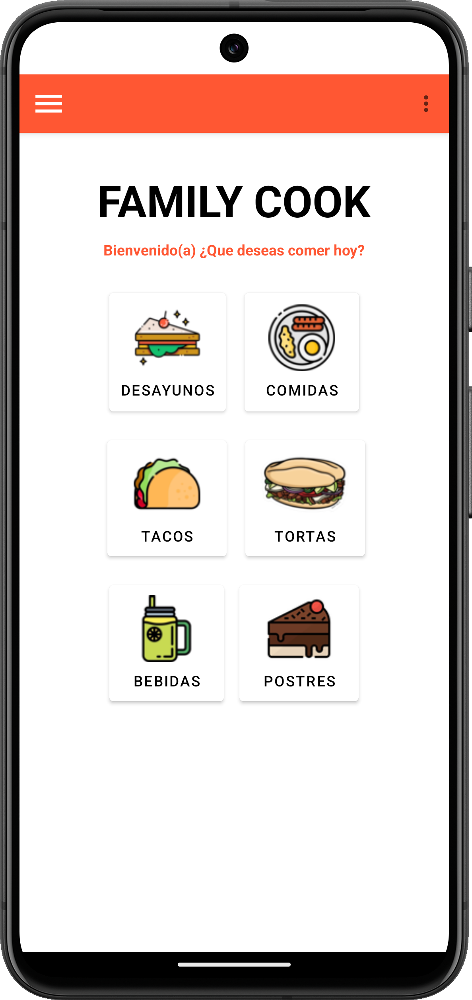
    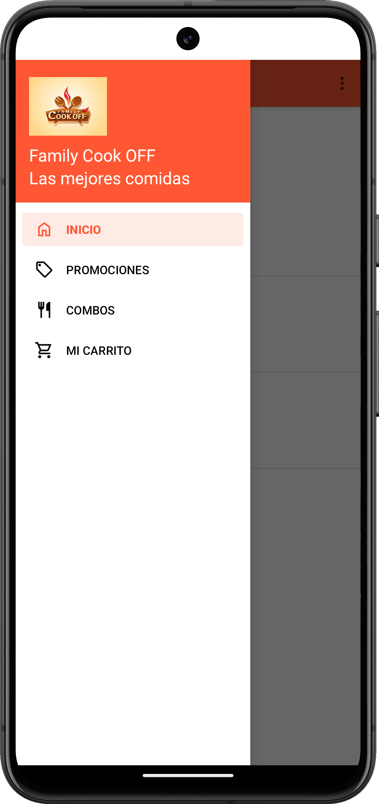
    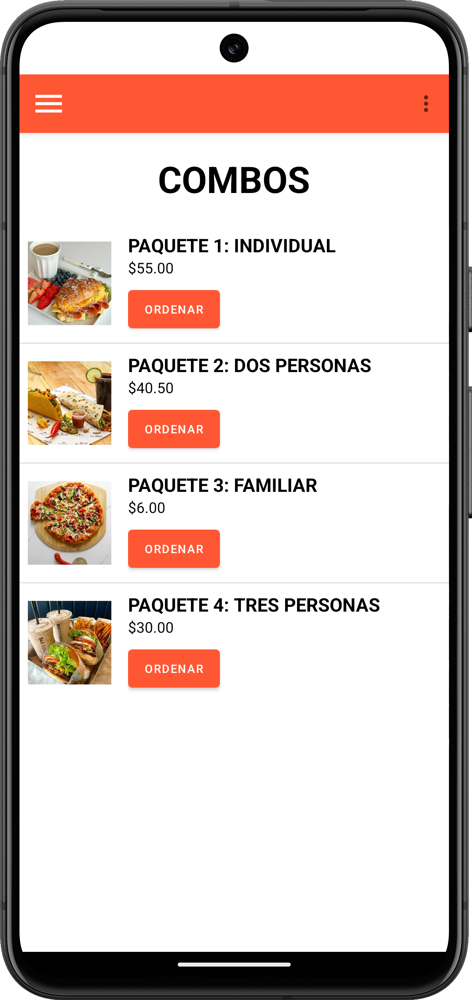

 

    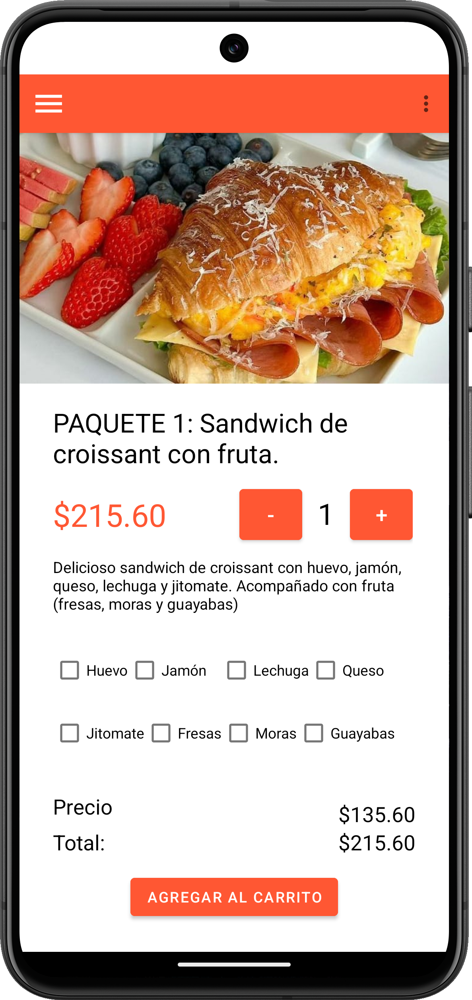
    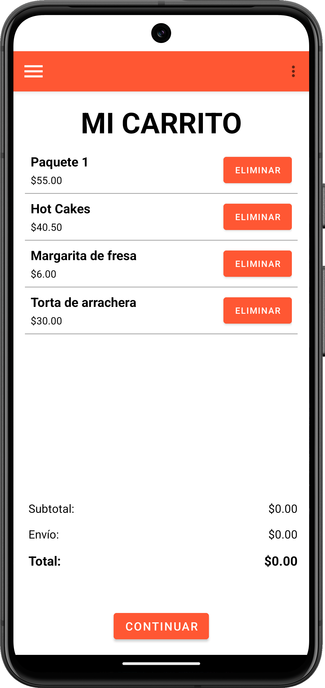
    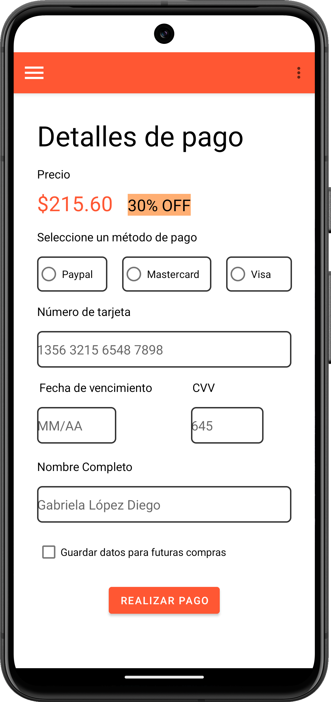

 

También incluimos pantallas adicionales que enlazan al dar click a cada uno de los botones de la pantalla principal _(Desayunos, Comidas, Tacos, Tortas, Bebidas, Postres)_

 

    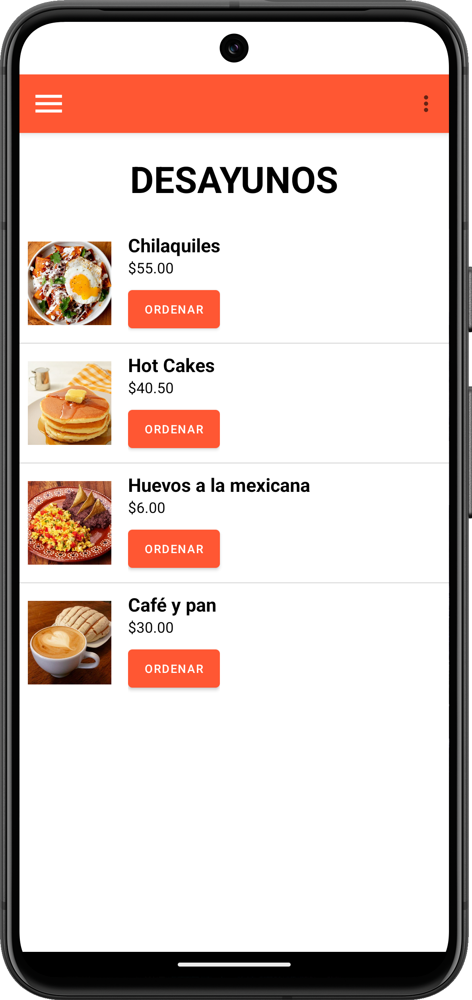
    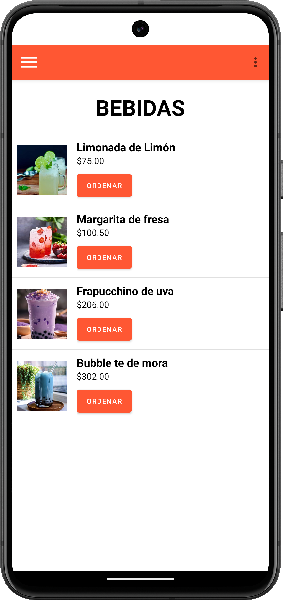
    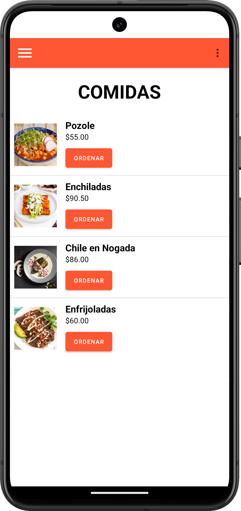

 

Así como pantallas que enlazan al dar click a cada una de las opciones del menú izquierdo desplegable _(Inicio, Promociones, Combos, Mi carrito)_

 

    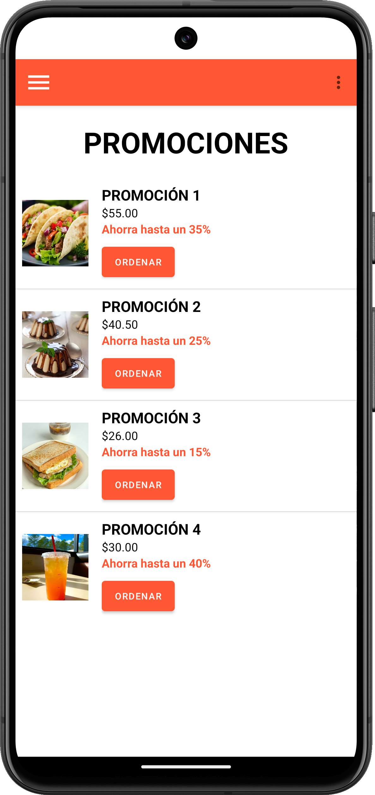
    
    

 

Y pantallas adicionales que responden al dar click a las opciones del menú superior 

 

    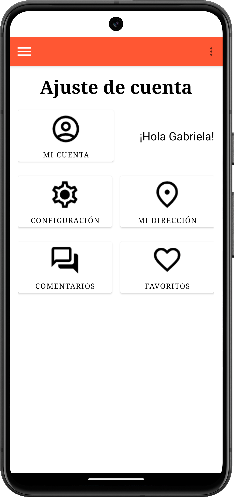
    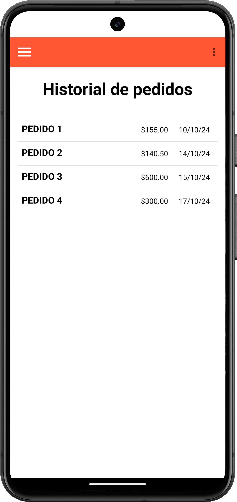
    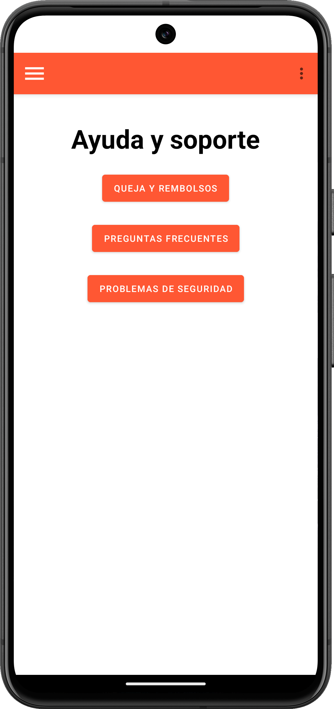

 

**NOTA**: Todas las pantallas implementadas cuentan con soporte para visualización en horizontal y se despliegan automáticamente, gracias a la implementación de listas dinámicas que facilitan la presentación del menú del restaurante. 